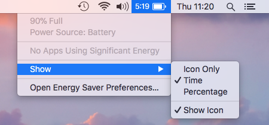
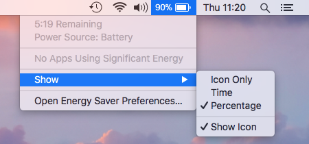

# BatteryExtra
SIMBL plugin for the Battery status indicator.

It makes the Battery status indicator work just like how it did back in Mac OS X Lion (10.7).

It supports macOS Sierra (10.12) and above.

Screenshots:

  - Show time:



  - Show percentage:



  - Show icon only:


  - Show time without icon:


  - Show percentage without icon:


# How to install
  1. Install [mySIMBL](https://github.com/w0lfschild/mySIMBL).
  2. Build from source or download the [latest version](https://github.com/kuglee/BatteryExtra/releases/latest).
  3. Open **BatteryExtra.bundle** with **mySIMBL**.
  4. Log out then log back in or run `killall -KILL SystemUIServer` from the command line.

# Preferences

To only show the battery icon without the label when fully charged, execute the following command in the command line:

```bash
defaults write com.apple.menuextra.battery.plist HideWhenCharged YES
```

To change it back run the following command in the command line:

```bash
defaults write com.apple.menuextra.battery.plist HideWhenCharged NO
```

You need to restart the system for the changes to take effect.
